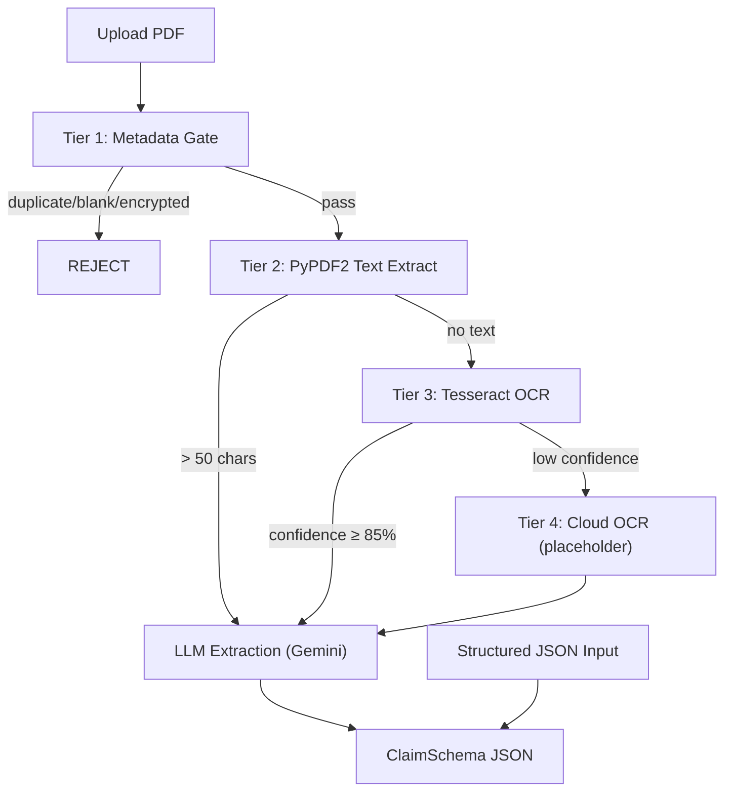

# M1 DocTriage Pipeline — Walkthrough

## What Was Built

Three new files implementing the complete M1 document upload & extraction pipeline:

| File | Purpose |
|------|---------|
| [pdf_service.py](file:///c:/Users/antop/OneDrive/Desktop/blahblah/backend/services/pdf_service.py) | PDF processing: hash computation, blank/encrypted checks, PyPDF2 text extraction, page-to-image conversion |
| [m1_doctriage.py](file:///c:/Users/antop/OneDrive/Desktop/blahblah/backend/modules/m1_doctriage.py) | Core 4-tier pipeline + LLM extraction + structured input (Path B) |
| [upload.py](file:///c:/Users/antop/OneDrive/Desktop/blahblah/backend/routes/upload.py) | `POST /upload-document` (PDF) and `POST /upload-structured` (JSON) endpoints |

## Pipeline Flow



## Verification Results

| Test | Result |
|------|--------|
| `pip install -r requirements.txt` | ✅ All dependencies installed |
| Server startup (`python main.py`) | ✅ `routes.upload` router loaded |
| `GET /health` | ✅ Returns `{"status": "healthy"}` |
| `POST /api/upload-structured` | ✅ Returns proper [ClaimSchema](file:///c:/Users/antop/OneDrive/Desktop/blahblah/backend/models/claim_schema.py#104-126) with auto-generated [claim_id](file:///c:/Users/antop/OneDrive/Desktop/blahblah/backend/modules/m1_doctriage.py#70-75) |
| `POST /api/upload-document` (PDF) | ⏳ Needs Gemini API key in `.env` to test |

## Next Step

To test PDF upload with LLM extraction, create `backend/.env`:
```
GEMINI_API_KEY=your-key-here
```
